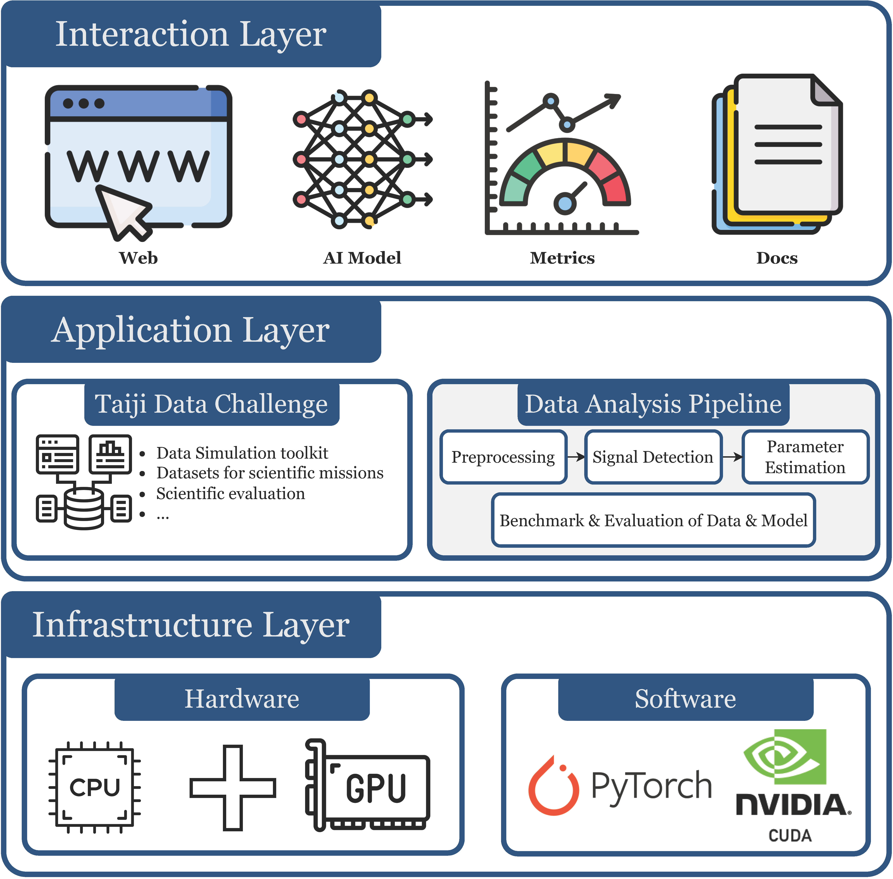

==========
About GWAI
==========

.. autosummary::
   :toctree: generated

AI-based methods are increasingly vital in gravitational wave data analysis (GWDA), enhancing signal processing and interpretation.
However, the field lacks a unified, AI-centered software platform, it is inconvenient for researchers to develop further AI algorithms.

We introduce an AI-centered, user-friendly software platform (GWAI) that designed to fill this gap in GWDA.
Then we demonstrate use cases in tasks like signal detection, denoising, waveform forecasting, and parameter estimation.
As the first of its kind in GWDA, GWAI aims to advance gravitational wave research by simplifying the application of AI techniques.

We provide our open-source code at `Github <https://github.com/AI-HPC-Research-Team/GWAI/tree/main>`_.
This document provides detailed :ref:`install` and :doc:`tutorials` for you to use GWDA.
If you find GWDA useful, please citing the :doc:`/citations`.

Overview of GWAI platform architecture is as follows.

